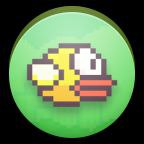
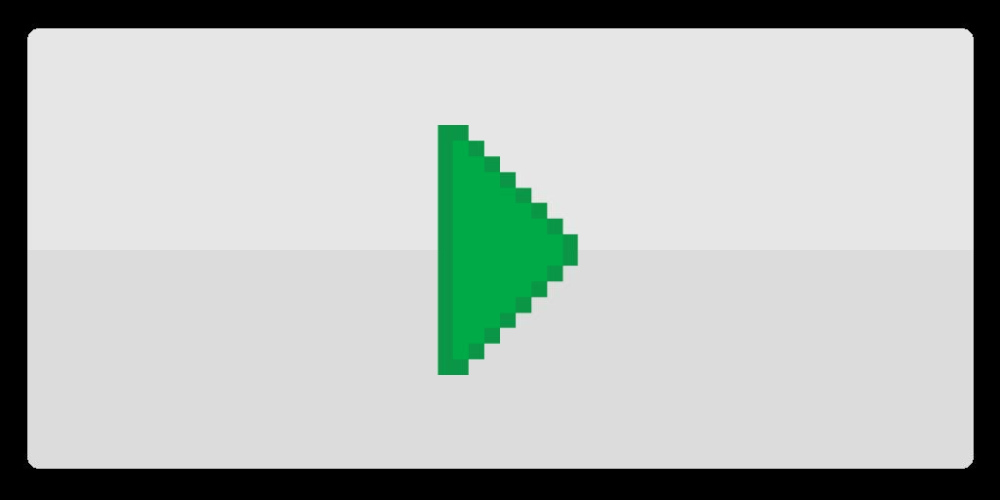
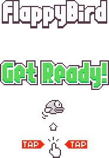
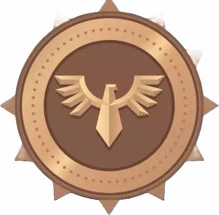
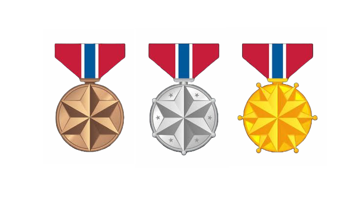

# Flappy Bird (Unity)

A 2D Flappy Bird style game built with Unity.

## Download APK

Use this direct link to download the Android build:

[Download Flappy Bird.apk](https://github.com/AnnonymousBanda/FlappyBird/raw/main/Flappy%20Bird.apk)

## Tech Stack

- Unity: 2022.3.4f1
- Language: C#
- IDE Support: Visual Studio / VS Code
- Platform: Android (APK)
- Version Control: Git + GitHub

## Installation Guide

### Option 1: Play on Android

1. Download the APK from the link above.
2. Copy the APK to your Android device if needed.
3. Enable install from unknown sources (one-time setting).
4. Install and launch the game.

### Option 2: Open and Work in Unity

1. Clone the repository:

```bash
git clone https://github.com/AnnonymousBanda/FlappyBird.git
cd FlappyBird
```

2. Open Unity Hub.
3. Click Add project and select the cloned folder.
4. Open using Unity 2022.3.4f1.
5. Wait for asset import to complete.
6. Press Play in the Unity Editor.

## Project Structure

- `Assets/`: Game scripts, sprites, sounds, scenes, prefabs
- `Packages/`: Unity packages
- `ProjectSettings/`: Unity project configuration

## Icon Images

### App and UI Icons

| Icon | Preview |
|---|---|
| App Icon |  |
| Exit Button |  |
| Restart Button |  |
| Game Over |  |
| Start Panel |  |

### Medal Icons

| Type | Preview |
|---|---|
| Bronze |  |
| Silver |  |
| Gold |  |
| Medal Set |  |

## Collaboration Workflow

After making changes:

```bash
git add .
git commit -m "Describe your change"
git push
```
